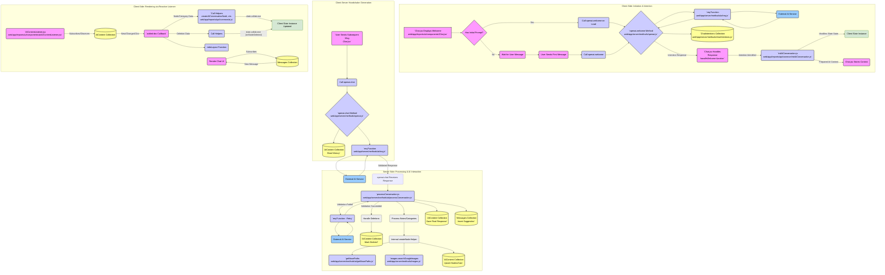

<!-- Parent Document: ../flows/ai-slate-generation.md -->
<!-- Documentation Home: ../README.md -->

[< Back to AI Slate Generation Flow](../flows/ai-slate-generation.md)

```mermaid
%%{init: {'flowchart': {'defaultRenderer': 'dagre', 'useMaxWidth': true}, 'theme': 'default', 'panZoom': true}}%%
graph TD

    %% --------------------- Client-Side: Initiation & Intention --------------------- %%
    subgraph client_init [Client-Side: Initiation & Intention]
        direction LR
        C_ChatJSX_Init[`Chat.jsx Displays Welcome<br/><i>web/app/imports/ui/components/Chat.jsx</i>`] --> C_CheckInitial{Has Initial Prompt?}

        C_CheckInitial -- Yes --> C_CallWelcomeLoad(Call openai.welcome on Load)
        C_CheckInitial -- No --> C_WaitForMsg(Wait for User Message)

        C_WaitForMsg --> C_UserSendsMsg(User Sends First Message)
        C_UserSendsMsg --> C_CallWelcomeMsg(Call openai.welcome)

        C_CallWelcomeLoad --> S_WelcomeMethod{`openai.welcome Method<br/><i>web/app/server/methods/openai.js</i>`}
        C_CallWelcomeMsg --> S_WelcomeMethod

        S_WelcomeMethod --> S_ReqJS_Welcome(`req Function<br/><i>web/app/server/methods/ai/req.js</i>`)
        S_ReqJS_Welcome --> ExtAI_Welcome(External AI Service)
        ExtAI_Welcome --> S_ReqJS_Welcome
        S_WelcomeMethod --> DB_ChatIntentions[(`ChatIntentions Collection<br/><i>web/app/server/methods/chatIntentions.js</i>`)]
        S_ReqJS_Welcome --> S_WelcomeMethod
        S_WelcomeMethod -- Intention Response --> C_HandleWelcome(`Chat.jsx Handles Response<br/><i>handleWelcome function</i>`)

        C_HandleWelcome -- Intention Identified --> C_InitAIConv(`initAIConversation.js<br/><i>web/app/imports/api/common/initAIConversation.js</i>`)
        C_InitAIConv -- Modifies Slate State --> C_SlateInstance(Client Slate Instance)
        C_InitAIConv -- Prepared AI Context --> C_StoreContext(Chat.jsx Stores Context)
    end

    %% --------------------- Client-Server Handshake: Generation --------------------- %%
    subgraph client_server_gen [Client-Server Handshake: Generation]
        direction LR
        C_UserSendsNextMsg(`User Sends Subsequent Msg<br/><i>Chat.jsx</i>`) --> C_CallChat(Call openai.chat)
        C_CallChat --> S_ChatMethod{`openai.chat Method<br/><i>web/app/server/methods/openai.js</i>`}
        S_ChatMethod --> DB_AIContent_ReadHist[(`AIContent Collection<br/><i>Read History</i>`)]
        S_ChatMethod --> S_ReqJS_Chat(`req Function<br/><i>web/app/server/methods/ai/req.js</i>`)
    end

    %% --------------------- Server-Side: Processing & AI Interaction --------------------- %%
    subgraph server_proc [Server-Side: Processing & AI Interaction]
        S_ReqJS_Chat --> ExtAI_Chat(External AI Service)
        ExtAI_Chat --> S_ReqJS_Chat
        S_ReqJS_Chat -- Validated Response --> S_ChatMethod_Recv(openai.chat Receives Response)
        S_ChatMethod_Recv --> S_ProcessConv(`processConversation.js<br/><i>web/app/server/methods/ai/processConversation.js</i>`)
        S_ProcessConv -- Validation Failed --> S_ReqJS_Retry(`req Function - Retry`)
        S_ReqJS_Retry --> ExtAI_Retry(External AI Service)
        ExtAI_Retry --> S_ReqJS_Retry
        S_ReqJS_Retry --> S_ProcessConv

        S_ProcessConv -- Validation Succeeded --> S_HandleDeletions(Handle Deletions)
        S_HandleDeletions --> DB_AIContent_Del[(`AIContent Collection<br/><i>Mark Deleted</i>`)]
        S_ProcessConv --> S_ProcessNodesCats(Process Notes/Categories)
        S_ProcessNodesCats --> S_CreateNodeHelper(Internal createNode Helper)
        S_CreateNodeHelper --> S_GetIcons(`getNounPaths<br/><i>web/app/server/methods/ai/getNounPaths.js</i>`)
        S_CreateNodeHelper --> S_GetImages(`images.searchGoogleImages<br/><i>web/app/server/methods/images.js</i>`)
        S_CreateNodeHelper --> DB_AIContent_Upsert[(`AIContent Collection<br/><i>Upsert Nodes/Cats</i>`)]
        S_ProcessConv --> DB_AIContent_SaveResp[(`AIContent Collection<br/><i>Save Final Response</i>`)]
        S_ProcessConv --> DB_Messages_Suggestion[(`Messages Collection<br/><i>Insert Suggestion</i>`)]
    end

    %% --------------------- Client-Side: Rendering --------------------- %%
    subgraph client_render [Client-Side: Rendering via Reactive Listener]
        direction LR
        C_AIListener(`AIContentListener.jsx<br/><i>web/app/imports/ui/components/ai/AIContentListener.jsx</i>`)
        C_AIListener -- Subscribes/Observes --> DB_AIContent_Listen[(AIContent Collection)]

        DB_AIContent_Listen -- New/Changed Doc --> C_AIListener_Added(`added doc Callback`)
        C_AIListener_Added -- Node/Category Data --> C_Helpers(`Call Helpers<br/><i>createAIConversationNode, etc.<br/>web/app/imports/api/common/ai.js</i>`)
        C_Helpers -- slate.collab.exe --> C_SlateInstance_Update(Client Slate Instance Updated)
        C_AIListener_Added -- Deletion Data --> C_Helpers_Del(Call Helpers)
        C_Helpers_Del -- slate.collab.exe (onNodeDeleted) --> C_SlateInstance_Update
        C_AIListener_Added --> C_RedoLayout(redoLayout Function)

        C_ChatJSX_Render(`Chat.jsx<br/><i>web/app/imports/ui/components/Chat.jsx</i>`)
        C_ChatJSX_Render -- Subscribes --> DB_Messages_Listen[(Messages Collection)]
        DB_Messages_Listen -- New Message --> C_ChatJSX_Render(Render Chat UI)
    end

    %% Styling %%
    classDef ui fill:#f9f,stroke:#333,stroke-width:2px,color:#000;
    classDef method fill:#ccf,stroke:#333,stroke-width:2px,color:#000;
    classDef db fill:#ff9,stroke:#333,stroke-width:2px,color:#000;
    classDef external fill:#9cf,stroke:#333,stroke-width:2px,color:#000;
    classDef internal fill:#eee,stroke:#333,stroke-width:1px,color:#000;
    classDef slate fill:#D5E8D4,stroke:#82B366,stroke-width:2px,color:#000;

    class C_ChatJSX_Init,C_CheckInitial,C_WaitForMsg,C_UserSendsMsg,C_HandleWelcome,C_StoreContext,C_UserSendsNextMsg,C_AIListener,C_AIListener_Added,C_ChatJSX_Render ui;
    class C_CallWelcomeLoad,C_CallWelcomeMsg,C_InitAIConv,C_CallChat,S_WelcomeMethod,S_ChatMethod,S_ReqJS_Welcome,S_ReqJS_Chat,S_ReqJS_Retry,S_ProcessConv,S_GetIcons,S_GetImages,C_Helpers,C_Helpers_Del,C_RedoLayout method;
    class DB_ChatIntentions,DB_AIContent_ReadHist,DB_AIContent_Del,DB_AIContent_Upsert,DB_AIContent_SaveResp,DB_Messages_Suggestion,DB_AIContent_Listen,DB_Messages_Listen db;
    class ExtAI_Welcome,ExtAI_Chat,ExtAI_Retry external;
    class S_HandleDeletions,S_ProcessNodesCats,S_CreateNodeHelper internal;
    class C_SlateInstance,C_SlateInstance_Update slate;
```
